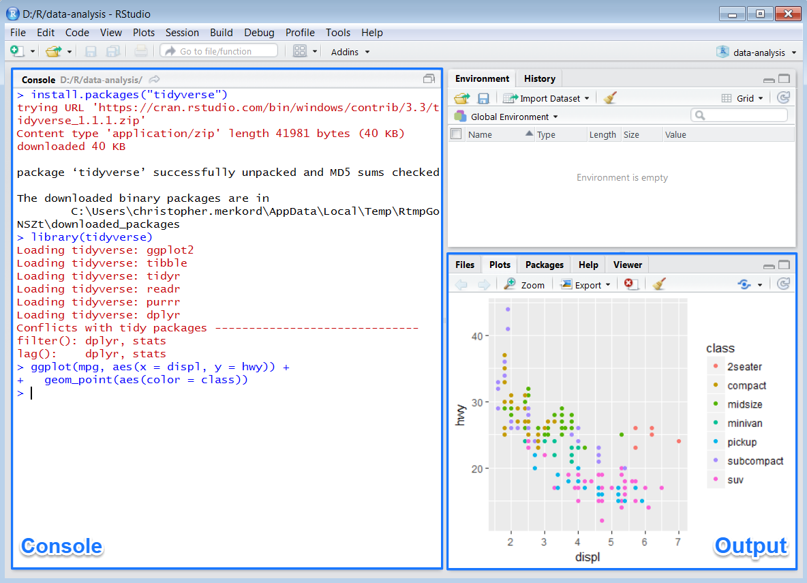

\pagenumbering{gobble}

```{r setup, include=FALSE}
knitr::opts_chunk$set(echo = TRUE)
```

## Welcome & Software Introduction

Welcome to the workshop! 

We will be using two main software packages in the workshop. The first is the R language and software environment, and the second is RStudio, an integrated development environment (IDE) that makes R easier to use. R and RStudio are both open source, which means that the software is freely available to all users and can be redistributed and modified. We will also be using MiKTeX to create pdf documents from R code on the last day.

The following instructions are written for Microsoft Windows users. We highly recommend this operating system so all participants are using the same one, also, no testing of epidemiar has currently been done on other operating systems.

We will be passing around a USB drive with all the needed installation files. Please copy this to your computer (in whichever folder you want), and pass the USB to the next person. 


### R

First, in the files you copied over to your laptop, navigate to */EPIDEMIA_workshop/Setup/*.  

Double click **R-3.5.1-win.exe** to begin the installation process. If you are prompted with the message "The publisher could not be verified. Are you sure you want to run this software?", then click "Run". Next, select the language you want R to use, but realize that the instructors may be unable to assist later if you use a language other than English. Click "Next >>" to continue. We recommend leaving all options on their default settings.

If you already have R installed on your computer, please update it to this one so all participants are using the same version.

### RStudio

RStudio is an IDE, or integrated development environment, for R. If you've closed the file explorer window, navigate back to the */EPIDEMIA_workshop/Setup/* folder.   

Double click on **RStudio-1.1.456.exe** file to begin the installation process. If you are prompted with the message "Do you want to run this file?", then click "Run". Then click "Next >>"" several times until the last step "Install". We recommend leaving all options on their default settings.

If you already have RStudio installed on your computer, update it to the newest version by following the directions above or by running RStudio and going to "Help > Check for Updates"" (if internet is available).

When you start RStudio, R will also start automatically and run within the RStudio interface. You will see two key regions in the interface:

```{r echo = FALSE, out.width = "75%"}

```

For now, all you need to know is that you type R code in the console pane, and press enter to run it. You'll learn more as we go along!


### R packages

You will also need to install some R packages. An R package is a collection of functions, data, and documentation that extends the capabilities of base R. Most of the packages that you will use in this workshop are part of the so-called tidyverse. The packages in the tidyverse share a common philosophy of data and R programming, and are designed to work together naturally.

When you have access to the internet, you can install packages (tidyverse in this example) by typing this line of code in the RStudio console and running it:

```{r, eval = FALSE}
install.packages("tidyverse")
```

R would download the packages from CRAN and install them on to your computer. 

However, for this workshop, we've collected all the packages we will use and pre-downloaded them.  

1. If you've closed the file explorer window, navigate back to the */EPIDEMIA_workshop/Setup/* folder, and then click on **Rpkgs_install_script.R**. This will open the R script in RStudio. 

2. Highlight all lines of code, and then either press CTRL+ENTER, or the green "Run" button. This will take a minute, but it will install many packages at once. 

You will not be able to use the functions, objects, and help files in a package until you load it with `library()`. Once you have installed a package, you can load it with the `library()` function:

```{r}
library(tidyverse)
```

This tells you that tidyverse is loading the ggplot2, tibble, tidyr, readr, purrr, and dplyr packages. These are considered to be the core of the tidyverse because you'll use them in almost every analysis. 

Packages in the tidyverse change fairly frequently. You can see if updates are available, and optionally install them, by running `tidyverse_update()`.


## Background Reading

Also, if you have time during this week, or after the workshop, here are two useful background readings. These readings also offer some insights into why R is widely used for data management and analysis in a variety of fields. 

They can be found online here:
* [http://www.nature.com/news/programming-tools-adventures-with-r-1.16609](http://www.nature.com/news/programming-tools-adventures-with-r-1.16609)
* [http://www.nature.com/news/programming-tools-adventures-with-r-1.16609](https://www.r-bloggers.com/why-you-should-learn-r-first-for-data-science/)

Or in the *EPIDEMIA_workshop/Setup/References/* folder.  
