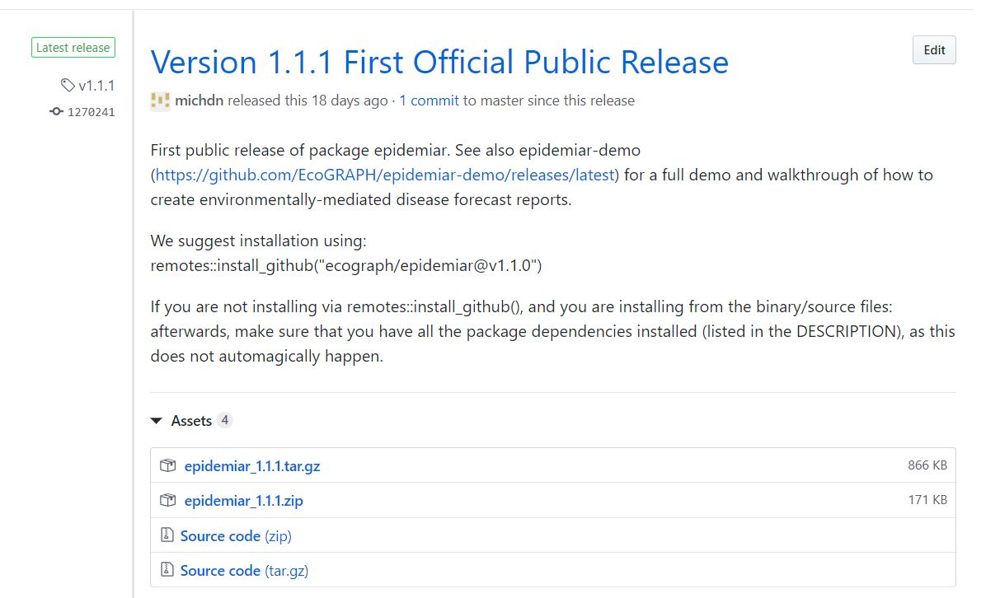
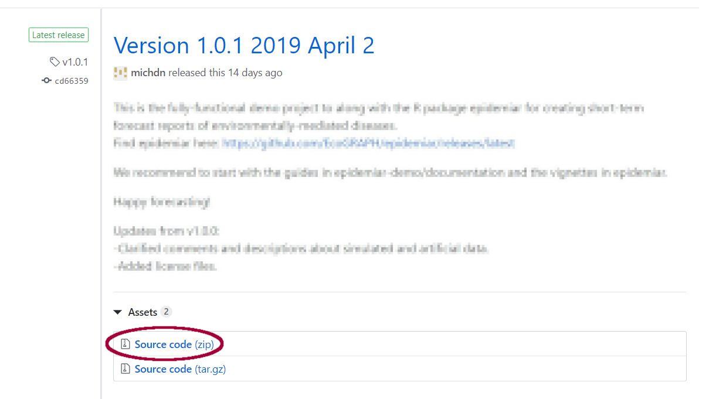

\pagenumbering{gobble}

```{r setup, include=FALSE}
knitr::opts_chunk$set(echo = TRUE)
```

# Welcome & Software Introduction

Welcome to the workshop! 

We will be using two main software packages in the workshop. The first is the R language and software environment, and the second is RStudio, an integrated development environment (IDE) that makes R easier to use. R and RStudio are both open source, which means that the software is freely available to all users and can be redistributed and modified. We will also be using MiKTeX to create pdf documents from R code towards the end of the workshop.

The following instructions are written for Microsoft Windows users. 


## R

R (https://www.r-project.org/) is a statistical programming language that runs all of our analyses and produces reports and documentation, including this document. It is free and has a wide variety of packages built by users all around the world to do many different statistical analyses.

It is easiest to download R from CRAN: https://cloud.r-project.org/. Click on the link for "Download R for Windows." Choose "base," then "Download R for Windows." Run this file and install R on your system. Use the default settings for the installer.

If you already have R installed on your computer, please update it to this one so all participants are using the same version.

## RStudio

RStudio is an IDE, or integrated development environment, for R. If you've closed the file explorer window, navigate back to the `/EPIDEMIA_workshop/Setup/` folder.   

RStudio (https://www.rstudio.com/) is an integrated development environment (IDE) and graphical user interface (GUI) that makes R easier to use. Download RStudio Desktop Open Source License (the free version). Choose the appropriate installer for your operating system (likely Windows Vista/7/8/10) from https://www.rstudio.com/products/rstudio/download/. Install it using the default settings in the installer.

If you already have RStudio installed on your computer, update it to the newest version by following the directions above or by running RStudio and going to "Help > Check for Updates"" (if internet is available).

When you start RStudio, R will also start automatically and run within the RStudio interface:

```{r echo = FALSE, out.width = "60%"}
knitr::include_graphics("images/rstudio-console.png")
```

In general, you type R code in the console pane, or use R scripts in the Source pane, and the results show up in the console (or the plot pane for graphics). You'll learn what all this means as we go along in the tutorials.

## R packages

You will also need to install some R packages. An R package is a collection of functions, data, and documentation that extends the capabilities of base R. Most of them that you will use in this workshop are part of the `tidyverse` set of packages. These packages share a common philosophy regarding data and R programming, and are designed to work together naturally.

You can install packages (tidyverse in this example) by typing this line of code in the RStudio console and running it:

```{r, eval = FALSE}
install.packages("tidyverse")
```

R will download the packages from CRAN and install them on to your computer. As you are running through the examples, if the library call returns a message that the package is not found, simply run the `install.packages()` command for that package (name in quotes) and try again.


## epidemiar package {#epidemiar-package-install}

The EPIDEMIA team has developed a R package called `epidemiar` for modeling malaria and creating the forecasting report. 

1. We suggest installing using `remotes::install_github()` function as this will automatically install dependent packages. Change the tag number to the most current release - which can be found by viewing https://github.com/EcoGRAPH/epidemiar/releases/latest. For instance, the command below installs version "v.1.1.0". 
Note: You may need to install `devtools` and `remotes` packages first, if you have not done so already. 

```{r, eval = FALSE}
remotes::install_github("ecograph/epidemiar@v1.1.0")
```

Alternatively, we can download using the binaries provided with the latest release. 

1. Navigate to https://github.com/EcoGRAPH/epidemiar-demo/releases/latest, and download the latest .zip or .gz.tar file.

```{r echo = FALSE, out.width = "60%"}

```

2. In RStudio, click on the "Packages" tab in the Files/Plots/Packages/Help pane, and click the "Install" button. 

3. Under "Install From", select "Package Archive File (.zip, .tar.gz)". Navigate to and select the zip file, and click "Install". 

4. If you follow this method, afterwards, you will want to make sure that you have all the package dependencies installed (listed in the DESCRIPTION).


## epidemiar-demo project {#epidemiar-demo-project}

The demo project can be downloaded from Github directly. 

1. Navigate to https://github.com/EcoGRAPH/epidemiar-demo/releases/latest. Click "Source code (zip)" to download the zipped folder of the latest update. (Note: below picture is of an earlier release, but the concept is the same.)

```{r echo = FALSE, out.width = "75%"}

```

2. Unzip the file to your Desktop or other preferred directory. You must have full read/write permissions to the directory, so do not use a system folder like Program Files. Unzipping the file will create a folder in the directory you choose. The folder name will have the version number in the file name, e.g. `epidemiar-demo-1.0.1`. This will help you keep track of which version of the project you are using. 


## MiKTeX

MiKTeX (https://miktex.org/) is an implementation of LaTeX, which is what allows us to automatically produce PDF reports of our forecasting results. Navigate to the site, and click on the How To link for your operating system (https://miktex.org/howto/install-miktex).

Click on the download page link (https://miktex.org/download) and then download the basic Installer. Run the installer, but make one change to the default settings. **The option for "Install missing packages on-the-fly" should be changed to "yes."** You will initially install an incomplete copy of MiKTeX, and it will be updated automatically whenever you run the code. This means that the first time you run the code to make a pdf, you will need an internet connection to acquire the missing MiKTeX packages.

After MiKTeX is installed, **restart your computer**. This will help RStudio recognize that MiKTeX is installed. 


## Background Reading

Also, if you have time during this week, or after the workshop, here are two useful background readings. These readings also offer some insights into why R is widely used for data management and analysis in a variety of fields. 

They can be found online here:

* [http://www.nature.com/news/programming-tools-adventures-with-r-1.16609]
* [https://www.r-bloggers.com/why-you-should-learn-r-first-for-data-science/]


